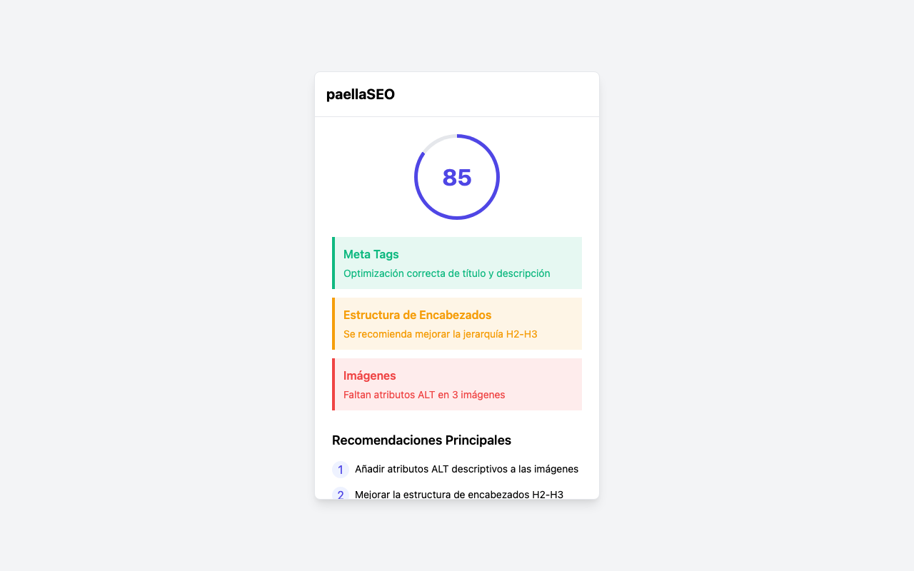
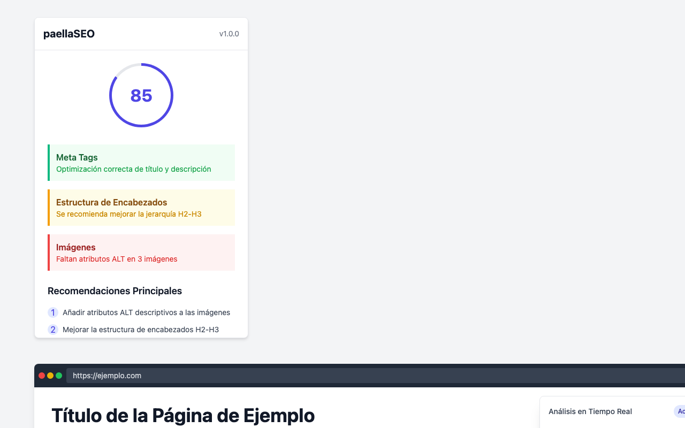

# paellaSEO


## Descripción

paellaSEO es una extensión de Chrome que proporciona análisis SEO en tiempo real para cualquier página web que estés visitando. Obtén recomendaciones prácticas e impulsa tu posicionamiento web sin complicaciones.

## Características

- **Análisis SEO en tiempo real** con puntuación global de 0-100
- **Evaluación detallada** de meta etiquetas, encabezados, contenido, enlaces e imágenes
- **Recomendaciones prácticas** priorizadas por impacto
- **Historial de análisis** para seguimiento de mejoras
- **Exportación de informes** para compartir o archivar
- **Interfaz intuitiva** y fácil de usar
- **Funcionamiento 100% local**, sin enviar datos a servidores externos
- **Análisis disponible en español**

## Capturas de pantalla


*Interfaz principal de la extensión con puntuación SEO y recomendaciones.*


*Análisis en tiempo real de una página web con overlay.*

## Instalación

1. Descarga la extensión desde la [Chrome Web Store](https://chrome.google.com/webstore/detail/paellaseo/ID)
2. Haz clic en "Añadir a Chrome"
3. ¡Comienza a analizar tus páginas web!

## Desarrollo

### Requisitos previos

- Node.js y npm

### Instalación para desarrollo

```bash
# Clonar el repositorio
git clone https://github.com/jlcases/paellaseo.git
cd paellaseo

# Instalar dependencias
npm install

# Compilar la extensión
npm run build

# Cargar la extensión en modo desarrollo en Chrome
# 1. Abre chrome://extensions/
# 2. Activa el "Modo desarrollador"
# 3. Haz clic en "Cargar descomprimida"
# 4. Selecciona la carpeta "dist" del proyecto
```

## Política de Privacidad

Consulta nuestra [Política de Privacidad](PRIVACY.md) para obtener información sobre cómo manejamos tus datos.

## Licencia

Este proyecto está licenciado bajo la licencia MIT - consulta el archivo [LICENSE](LICENSE) para más detalles.

## Contacto

Para cualquier consulta, puedes contactarnos a través de [tu-email@ejemplo.com]. 